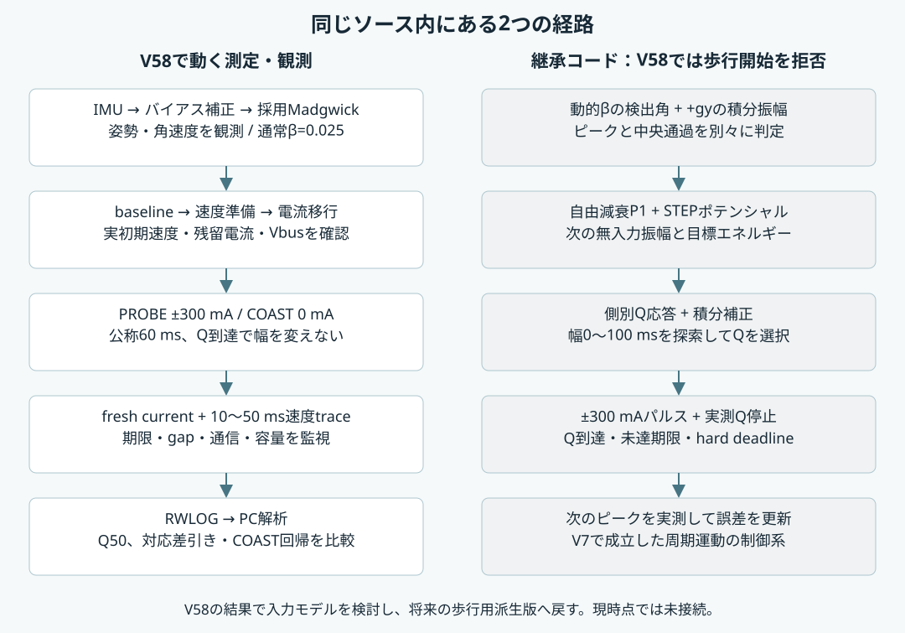

# V58 動作解説 — 姿勢推定・制御計算から測定と記録まで

対象: `paired_probe_coast_v58_50ms_20260913`。2026-09-19に実ソースと2026-09-13のビルドmanifestを照合。記述は同梱ソースの挙動であり、新しい制御案ではありません。

## 1. 全体像と、この版で実際に動く範囲

V58は、車輪の初期速度によってパルスへの応答が変わる理由を調べるプログラムです。固定電流を与えるPROBEと、0 mAのまま観測するCOASTを近い初期状態で比較します。姿勢推定を含む歩行ファームウェアから派生していますが、最新の測定では姿勢誤差から出力Qを計算する歩行ループを使いません。

| 処理 | V58測定中 | 役割 |
| --- | --- | --- |
| IMU取得・起動時ジャイロバイアス校正 | 有効 | 姿勢・角速度の観測、IMU健全性確認 |
| 採用Madgwick系列 HOLD_073 | 更新する | 観測系列。ただしV58専用パルスとはβ切替が連動しない |
| β=1、固定β、保持120/170 ms、turnfast等の比較系列 | 測定中の比較フィルタ更新を抑制 | 電流取得を優先するため。保持値を新規観測と解釈しない |
| 歩行用ピーク検出・エネルギー/Q選定 | V58の開始経路では無効 | 継承コードとして残る。第6〜8節で説明 |
| 車輪のSpeed Mode準備 | 有効 | ドライバ内部の速度制御で初期回転を作る |
| Current Mode固定PROBE/COAST | 有効 | ±300 mAまたは0 mAの指令、実電流・速度記録 |
| 実測Q到達による途中停止 | V58では使わない | 固定条件の比較を保つ。通常歩行用コードとは別 |
| 時刻・通信・電圧・速度・保存容量の監視 | 有効 | 不良試行とRun全体の異常終了を区別 |



`web_ui.cpp` の `/start-energy-control-autonomous`、`/start-energy-control-v0`、`/start-passive` はHTTP 409で拒否します。V58の画面はSmall/Fullの固定測定専用です。旧名が残る関数・列名だけで動作版を判断せず、revisionと呼出し経路を見てください。

参照: [main.cpp](../firmware/src/main.cpp)、[web_ui.cpp](../firmware/src/web_ui.cpp)、[fixed_probe_runner.cpp](../firmware/src/fixed_probe_runner.cpp)。関数と行番号の一覧は [SOURCE_MAP.json](../evidence/SOURCE_MAP.json)。

## 2. ハードウェア、起動、実行周期

マイコンはAtomS3-CAM系ESP32-S3、Arduino/PlatformIOです。M5Unifiedで内蔵IMUを取得し、Roller485は名前にかかわらず本ソースではI2Cで操作します。I2CはSDA=GPIO2、SCL=GPIO1、400 kHz、アドレス0x64。電流・速度のraw値は100で割ってmA・rpmにします。

起動ではWi-Fi APを先に作り、PSRAM、IMU、ドライバを初期化して出力を停止します。その後、5秒のジャイロ校正と5秒のMadgwick整定を経て `READY_TO_MEASURE` になります。校正は取得した3軸ジャイロの平均です。起動中の静止をソフトが厳密に選別して平均する実装ではないため、機体を静止させて起動します。

| 対象 | ソース上の周期・扱い |
| --- | --- |
| IMU | 公称5 ms、200 Hz |
| モーター電流 | 基本の高速予定2 msに加え、V58の状態処理・他読取りの前後で強制取得 |
| 電流の許容gap | 3,333 µs。500 Hzが実機で常時保証されるという意味ではない |
| ドライバ状態 | 基本20 ms。V58用処理へ分岐 |
| V58の一般時系列 | 100 ms、10 Hz |
| V58の専用速度trace | 開始直前と開始後10/20/30/40/50 msを予定し、実読取り完了時刻を記録 |
| Web | 測定の電流取得優先中は処理を延期 |

Arduinoの `loop()` が各処理を協調実行します。独立した高速割込みで全計測を同時実行する構成ではありません。電流取得→安全処理→IMU→ドライバ状態→実験更新という順序を基本に、IMU・状態読取りの前後へ電流取得と停止処理を挟みます。遅れは `TimingAudit` と電流gapで記録・判定します。

参照: [config.h](../firmware/src/config.h)、[main.cpp](../firmware/src/main.cpp)、[roller485_manager.cpp](../firmware/src/roller485_manager.cpp)。

## 3. 姿勢推定の入口と座標の区別

`ImuManager::update()` が `gx, gy, gz`（deg/s）と `ax, ay, az`（g）を取得し、読取り成功時刻・実更新間隔を保持します。`ExperimentRunner::updateFilterSeries()` がその新規サンプルだけを採用系列へ渡します。`ImuManager` にも比較用Madgwickがあるため、同クラスの `pitch_deg` だけを主制御姿勢と考えないことが重要です。

起動時の平均を `(bx, by, bz)` とすると、バイアス補正入力は次です。

```text
ωcorrected = (gx − bx, gy − by, gz − bz)
歩行の物理角速度 = gy − by
旧pitch系の角速度 = −(gy − by)
```

採用系列は `filter_dynamic_bias_[FILTER_ADOPTED_INDEX]`、index=2の `HOLD_073` です。補正なしの同系列も更新しますが、採用出力は補正ありです。過去の `pitch` 命名と、機体の物理的な左右rollが併存しているため、次の4つを区別します。

| 量 | 計算・用途 |
| --- | --- |
| 採用Madgwick角 | `getPitch()` に `PITCH_SIGN=+1`。主に中心通過・極値の検出座標 |
| 物理roll候補 | `atan2(ax, sqrt(ay²+az²)) × 180/π`。加速度だけから求める静的角度 |
| 校正済み物理roll | `0.9278941864 × 候補角 − 0.4983084809 deg`。静止治具で校正した表示 |
| 歩行のピーク振幅 | バイアス補正した `+gy` を積分し、動画対応係数0.908911を掛けた座標の絶対値 |

`current_roll_deg` は校正済み物理rollから表示ゼロを引いた値です。角速度が0.5 deg/s以内で500 ms続き、表示目標から0.20度以内なら表示上のready判定になります。このreadyはV58パルスの出力許可条件や、動的姿勢の精度保証ではありません。

加速度角は運動加速度も含むため、動作中の「真の姿勢」とは呼びません。また、歩行では採用Madgwick検出角と `+gy` の符号が逆になる関係を、ピーク側の変換 `physical_side = −detector_side` で扱っています。

参照: [imu_manager.cpp](../firmware/src/imu_manager.cpp)、[experiment_runner.cpp](../firmware/src/experiment_runner.cpp) の `updateStartupCalibration`、`updateFilterSeries`、`updateDisplayedAngles`、`updateCurrentRollState`、`physicalRollCandidateDeg`。

## 4. Madgwickが行う計算と動的β

このコードは `updateIMU()` を使用し、磁気センサを入力しません。姿勢はクォータニオンqで内部保持します。ローカルのAdafruit AHRS 2.4.0実装を要約すると、ジャイロから得る回転速度に、加速度と予測重力方向のずれを減らす補正を加えます。

```text
qdot = 1/2 × q ⊗ (0, ωrad/s) − β × 正規化した重力誤差の勾配
qnext = normalize(q + qdot × Δt)
```

βは加速度による姿勢修正の強さです。大きければ重力方向へ早く戻り、小さければ短時間のジャイロ積分を強く保ちます。モーター入力中の加速度を重力と誤解して姿勢を引っ張らないため、継承された歩行系ではパルス中と直後にβを下げます。

**時間刻みの実装上の区別:** フィルタは `begin(200)` で初期化され、呼出しは実dtを渡さない6引数版です。従ってMadgwick内部の積分は公称5 msです。別途記録する `update_dt_us` や歩行用ジャイロ積分の実dtと同一ではありません。全姿勢計算が実測dtに追従すると説明してはいけません。

### 歩行用のβ下限を作る電流モデル

以下のuは指令電流の絶対値[mA]、Vはモデル電圧[V]です。

```text
Isat(V) = 329.547119 + 46.253815 × (V − 7.50)                     [mA]
Igoal(u,V) = u / {1 + (u/Isat)^3.86}^(1/3.86)                   [mA]
τrise(u) = {31.4 + (72.8−31.4)/(1+(u/372)^4.35)} / 1000        [s]
Ipeak = Igoal × (1 − exp(−T/τrise))                            [mA]
βfloor = 0.005 + 0.005 × clamp(Ipeak/300, 0, 1)
```

`Ipeak` はβ選定用のモデル値で、この式は初期電流をゼロとしたものです。後述のQ予測では別に初期電流項を含みます。βの下限を瞬時の実測電流からフィードバックしているわけではありません。`updatePulseModelPrediction()` は電圧を6.18〜8.02 Vに制限し、読取りが使えない場合は7.50 Vを使用、その状態を記録します。ドライバの安全ガード6.18〜8.10 Vとは用途が異なります。

### 採用HOLD_073の時間変化

歩行側の `status_.pulse_active` がtrueの間と、最後のパルス終了から73 msはβfloorを維持します。その後、50 msの二次曲線による緩やかな立上げから直線増加へ移り、上限0.025へ戻します。復帰は指数関数ではありません。

```text
r = 0.000450 × (0.025 − βfloor)/(0.100 − βfloor)  [1/ms]
x = パルス終了からの経過ms − 73
0 ≤ x < 50:  β = min(0.025, βfloor + r × x²/(2×50))
x ≥ 50:      β = min(0.025, βfloor + r × (x − 25))
```

例えばβfloor=0.008なら、復帰開始から約229 ms、パルス終了から約302 msで上限に達する計算です。これは式からの例で、V58で実測した復帰時間ではありません。起動校正・整定・READY・開始同期では系列をβ=0.100に揃えます。設定にある `MADGWICK_BETA_DYNAMIC_MAX=0.050` ではなく、採用系列配列に入っている **0.025** がこの版の実際の上限です。

保持120/170 ms、turnfastは比較用です。turnfastは反転を連続3点で確認後25 msで復帰、400 msのfallbackを持ちますが、V58測定中はこの比較フィルタを進めません。`BETA_PHASE_RETURN_TEST_ENABLED=false` の位相復帰法も採用していません。

参照: [experiment_runner.cpp](../firmware/src/experiment_runner.cpp) の `updateFilterSeries`、`updatePulseModelPrediction`、`predictCurrentGoalMa`、`predictRiseTauS`、`predictBetaMin`、`betaCeilingForStrategy`、[config.h](../firmware/src/config.h)。

## 5. V58測定中の姿勢推定は、歩行時と何が違うか

V58の開始処理は歩行制御フラグをfalseにし、`status_.pulse_active=false`、`last_pulse_end_ms_=0` にします。その後の固定パルスは `Roller485Manager` 内の `FixedProbeV57::PROBING` と `command_mA_` で管理され、歩行側のパルス状態・βモデル更新へ通知する経路を持ちません。

このため、通常のV58開始経路では採用フィルタを更新していても、βは測定開始時に選ばれた **0.025を維持**します。物理的に±300 mAを出しているからといって、HOLD_073の低β・73 ms保持が発動しているとは限りません。これは今回のソース読解で確認した接続関係であり、今回は変更していません。

また、V58は測定開始時の `captureAngleOffsets()` を通りません。採用角は継続したフィルタ座標と既存offsetに依存し、各PROBEの開始角をゼロにした角度ではありません。一般時系列の `pulse_active` や `motor_cmd_mA` も継承されたrunner側の項目です。V58の実パルス・役割・時刻は **`paired_probe_v58` のtrial情報、CURRENTの実測、専用速度trace** を使って判定します。

V58で姿勢がPROBEの方向・幅を決めることはありません。IMUの停止・staleは全体安全処理に使われますが、姿勢の大小による±8度制御ではありません。将来この推定系列を再び歩行出力へ接続する際は、測定用状態と歩行用状態の違いを保ったうえで再検証する必要があります。

参照: [fixed_probe_runner.cpp](../firmware/src/fixed_probe_runner.cpp)、[fixed_probe_manager.cpp](../firmware/src/fixed_probe_manager.cpp)、[experiment_runner.cpp](../firmware/src/experiment_runner.cpp) の `beginMeasurementRun`、`updateFilterSeries`、`logSampleNow`。

## 6. 継承されている歩行制御 — いつ出力するか

**この節と次の2節は同梱コードに残るAutonomous V7系の説明です。V58のSmall/Fullからは実行しません。** ソースの理解と、現在の測定がどの計算を改善しようとしているかをつなぐために記載します。

歩行系は毎5 msの姿勢誤差に単純なPIDを掛ける方式ではなく、半周期のピークと中央通過を単位として入力を選びます。

```text
起動キック（−300 mA、公称100 ms）
  → 最初のピーク待ち
  → ピークを確定して前回振幅を保持
  → 続く中央通過で次の入力Qを計算
  → Qに対応する±300 mAパルス
  → パルス終了後、次のピーク待ち
```

採用Madgwick角から開始基準を引いた検出角が、0をまたぐと中央通過候補です。前後角の絶対値比で時刻と角速度を線形補間します。ピークは検出角の極大・極小と、中心へ戻る角速度の符号を3サンプル連続で確認して採用します。既知の入力過渡による偽イベントを避けるため、中央通過間隔250 ms以上、直前の中央通過からピークまで125 ms以上などの制約があります。

パルス中も姿勢・ジャイロ積分・検出履歴の更新は続けますが、新しい物理制御イベントへの昇格を抑制します。1つの確定ピークに対して1つの中央通過を対応させ、連続誤発火を避けます。

エネルギー計算に渡すピーク振幅Aは、Madgwick角そのものではなく、開始基準のジャイロ積分です。

```text
θgyro[k] = θgyro[k−1] + 0.908911 × (ω[k−1]+ω[k])/2 × Δt
A = |ピーク候補時の θgyro|
```

ここでは実測dtを使い、0〜25 ms以内の区間だけを積分します。中央通過ごとに積分ゼロへ戻す実装ではありません。検出用の座標と振幅用の座標を分離していることが、制御計算を読むうえで重要です。

参照: [experiment_runner.cpp](../firmware/src/experiment_runner.cpp) の `updateEnergyControlAutonomousMotion`、`updateEnergyControlAutonomousPeakTracker`、`recordEnergyControlAutonomousPeak`。

## 7. 継承されている歩行制御 — エネルギーから必要Qを決める

### STEP形状のポテンシャル

重心高さと接触形状から、角度Aに対応する位置エネルギー `U(A)=mg[h(A)−h0]` を計算します。aはAの絶対値をラジアンに変換した値です。

```text
R=0.150 m、xi=0.005 m、xo=0.045 m、h0=0.120 m
m=0.1997 kg、g=9.80665 m/s²
ai=asin(xi/R)、ao=asin(xo/R)、hc=sqrt(R²−xi²)

0 ≤ a ≤ ai:  h(a)=h0 cos(a)+xi sin(a)
ai < a ≤ ao: h(a)=R+(h0−hc)cos(a)
U(A)=mg[h(a)−h0]
```

外側境界aoは約17.46度です。それより外ではNaNを返し、モデル領域外として扱います。次の入力を与えなかった場合は、エネルギー減衰係数α=0.8706716644、Ec=0として、次の振幅を予測します。

```text
Enext = α U(Aprevious) − Ec
Afree = U⁻¹(max(0, Enext))
```

逆関数は32回の二分探索です。これは自由減衰のモデル予測であり、常に次の実ピークに一致するわけではありません。

### Qから次ピークへの側別補正

QはmA·s単位の電流積分量です。トルク定数を掛けた厳密な機械エネルギーそのものではありません。側別の経験的なQ→角度増分を使い、予測角からポテンシャルへ変換します。

| 係数 | 物理＋側 | 物理−側 |
| --- | --- | --- |
| 基本ゲイン gbase [deg/(mA·s)] | 0.29032 | 0.25455 |
| V6実測fitの切片 cfit [deg] | 0.4986094379 | −1.239921640 |
| V6実測fitのゲイン gfit | 0.6583242379 | 0.6580326445 |

```text
cused = 0.5 cfit
gused = gbase + 0.5(gfit−gbase)
δA = clamp(cused+(gused−gbase)Q, −1.5, +1.5)  [deg]
Apred = max(0, Afree + gbase Q + δA)
Epred = U(Apred)
```

通常目標は8度、設定候補は8/10/12度です。幅0〜100 msを1 ms刻みで走査し、予測Q・次ピーク・エネルギーを計算して `|U(Atarget)−Epred|` が最も小さい幅を選びます。単に `Q=(目標角−現在角)/gain` としているのではありません。角度差の式は診断量として別に残っています。

側ごとの積分補正Zも持ちます。ピーク確定時に `Zside += 0.10 × (Atarget−Ameasured)` [mA·s] と更新し、feedforward Qへ加えます。上限・下限に飽和したとき、その飽和を強める向きの誤差は積分を止めます。その後Qを0〜予測Qavailableへ制限し、もう一度整数幅でエネルギー誤差を最小化します。幅0なら出力しません。Qavailableは100 msの**モデル予測値**であり、実機が必ず投入できる保証値ではありません。

参照: [experiment_runner.cpp](../firmware/src/experiment_runner.cpp) の `energyControlPotentialJ`、`energyControlAutonomousFreeNextPeakAmplitude`、`energyControlAutonomousCorrectedPrediction`、`updateEnergyControlAutonomousAtZeroCross`。

## 8. 継承されている歩行制御 — 電流予測と実測Q停止

指令方向をd=±1、初期符号付き電流をI0、目標電流を `I∞=d Igoal` として、一次遅れを使います。

```text
I(t)=I∞+(I0−I∞)exp(−t/τrise)
Qpred(T)=I∞T+(I0−I∞)τrise(1−exp(−T/τrise))
```

継承されたV7の選定処理では、I0は前回パルス終了電流の予測を70 msで減衰させた推定値です。過去のモデル測定でI0を実測したことと、現在のこの選定関数が実測I0を直接使用していることは別です。V58は一方で開始直前の電流を実測し、trialに保存します。

通常歩行の出力経路にはV51/V52由来の `MeasuredQStop` があり、fresh currentだけを使って方向付き電流 `dI` を台形積分します。最初の有効サンプルを積分の起点とし、開始から最初の読取りまでをモデルで埋めません。負の方向付き電流も残し、正値へ切り上げません。

Q目標到達でゼロ指令、未到達なら選定幅+10 ms（最大100 ms）の待機期限、または100 msのhard deadline側で停止します。hard deadlineにはゼロ書込み用1.5 msの余裕を設け、直前3 msでは重い処理を避けます。最大gapは3,333 µsで、欠測を次の正常読取りで帳消しにしません。

この停止Q、`QObserver`の開始端点補間診断、V58のオフラインQ50は定義が異なります。V58は同じ `serviceMeasuredQStop()` 名の入口を呼んでも、専用分岐 `serviceFixedProbeSafety()` へ進むため、Q到達による途中停止をしません。

参照: [measured_q_stop.h](../firmware/src/measured_q_stop.h)、[q_observer.h](../firmware/src/q_observer.h)、[roller485_manager.cpp](../firmware/src/roller485_manager.cpp)、[experiment_runner.cpp](../firmware/src/experiment_runner.cpp) の `predictedChargeMaS`。

## 9. V58の測定条件と状態遷移

5つのaligned速度領域（−300/−150/0/+150/+300 rpm）×2方向×PROBE/COASTの20条件です。aligned速度は `d × 実測車輪速度` で、領域の名前を実測速度として使いません。COASTにも比較用の仮想方向dを与えますが、電流指令は0です。

| 項目 | Small | Full |
| --- | --- | --- |
| 1条件の有効目標 | 1 | 5 |
| 全体の有効目標 | 20 | 100 |
| 1条件の試行上限 | 2 | 10 |
| 全体の最大試行 | 40 | 200 |
| Run時間予算 | 10分 | 10分 |

速度・方向の条件ブロック順をshuffleし、同条件のPROBE/COASTを隣接して予定します。先行役割はブロックごとに交代します。必要数に達した条件はスキップするため、最後まで常に1対1の隣接ペアになる保証はありません。予定 `pair_id` も初期状態一致の証明ではありません。

```text
READY → 開始LED同期（5秒）
  → BASELINE → PREPARING → TRANSFER_WAIT → PROBING
  → ゼロ指令・終了側速度取得 → 次のBASELINE
  → 条件達成または上限 → 出力停止 → 終了LED同期（5秒）→ FINISHED
```

実装には `POST_SPEED` というenumも残っていますが、現行の主経路は `zeroFixedProbePulse()` 内で終了側速度を読み、`advance()` で次の試行へ進みます。enum一覧だけから独立した待機状態があると解釈しないでください。

参照: [fixed_probe_v57.h](../firmware/src/fixed_probe_v57.h)、[fixed_probe_manager.cpp](../firmware/src/fixed_probe_manager.cpp)。

## 10. baseline、速度準備、電流モードへの移行

各試行はCurrent Mode 0 mAから始めます。前のパルス尾部を次のbaselineにしないよう最低500 ms待ち、その後、約5 ms間隔の41点・200 ms以上の静定窓を作ります。速度は5 rpm以内、後半21点の電流medianとMAD（median absolute deviation）を使用します。

受入条件はMAD≤0.1 mA、全窓のmax−min≤0.5 mA、電流の線形傾きの絶対値≤0.2 mA/sです。baseline取得は10秒が上限です。medianは電流の基準点、MADはその周りのばらつきで、モデルで推定した残留電流を引いて静定に見せる方式ではありません。

非ゼロ速度条件はOUTPUTを一旦止め、Current指令0を保持してからSpeed Modeへ切り替え、電流上限300 mAと速度目標を設定し、読戻し確認後にOUTPUTを有効にします。初期準備速度は中速領域200 rpm、高速領域400 rpmで、方向と領域に応じて符号を付けます。機体側の独自速度PIDは本ソースにはなく、Speed Modeの内部制御はドライバ側です。

準備成立は、目標から `max(20 rpm, 目標絶対値×5%)` 以内、100 ms以上離れた速度点から計算した傾き≤100 rpm/sの状態が200 ms続くことです。準備の制限時間は3秒。ゼロ速度条件では準備回転を省略します。

続いてCurrent Modeへ切り替え、0 mAを書き込み、次を30 ms連続で満たすのを待ちます。

```text
|Iraw − Ibaseline| ≤ max(3×MADbaseline, 0.2 mA)
```

この移行待ちは最大1.5秒です。開始直前にVbus、fresh current、fresh speedの順で取り直し、電流age≤3,333 µs、速度age≤2,000 µsと、実速度領域を確認します。ゼロ領域は±20 rpm、中速・高速領域は中心±75 rpm（225 rpm境界は中速側）です。

待つ間に速度が落ちて領域を外れた場合はパルスを出さず無効試行にします。速度が低すぎた中速条件の準備目標を25 rpm増やす処理はありますが、最大400 rpmで、PROBE/COASTの同条件へ共有します。判定閾値や測定パルス幅を自動で緩める処理ではありません。

参照: [fixed_probe_baseline.h](../firmware/src/fixed_probe_baseline.h)、[fixed_probe_v57.h](../firmware/src/fixed_probe_v57.h)、[fixed_probe_manager.cpp](../firmware/src/fixed_probe_manager.cpp)。

## 11. PROBE/COASTの出力、速度観測、停止

開始レジスタ書込みが完了した時刻を共通の `event_start_us` とします。PROBEは±300 mA、COASTは0 mAを書きます。COASTもドライバのCurrent ModeとOUTPUTは有効なので、無通電の自由回転と同一とは断定できません。

開始前の速度をtrace[0]とし、その後10/20/30/40/50 msに予定した速度を保存します。各速度読取りの直前にfresh currentを取得・積分し、速度読取りの直後にも電流を再取得します。状態レジスタ群を読む途中にも速度予定を処理し、50 msの点を遅らせにくくしています。

50 ms側の速度は、開始から50〜52 ms以内に読取りを完了した点を有効とします。`speed_observation_dt_us` はこの点と**開始直前の速度読取り**の実時間差です。予定時刻10/20/…にセンサ内部で同時サンプリングした値ではありません。

公称指令幅は60 msですが、ゼロ書込み完了を60 ms内へ収めるため、開始後58.5 ms以降に停止処理を始めます。実幅は開始書込み完了からゼロ書込み完了までで、厳密に60.000 ms一定ではありません。V57bでは約58.7〜59.4 msでしたが、V58の実機幅は未測定です。

速度50 ms点だけが遅れた場合は試行を無効にして次へ進みます。通信失敗、stale、速度650 rpm超、電圧範囲6.18〜8.10 V外、ドライバ状態不整合、保存容量不足、停止期限違反などはRunを停止します。650 rpmは設定された観測時の停止基準で、観測間の瞬間速度の保証ではありません。

参照: [fixed_probe_manager.cpp](../firmware/src/fixed_probe_manager.cpp) の `beginFixedProbePulse`、`sampleV58Speed`、`serviceFixedProbeSafety`、`zeroFixedProbePulse`。

## 12. Q50、速度差、自然変化の差引き

主解析のQ50は、開始書込み完了を0として正確に0〜50 msの方向付きraw電流を積分します。

```text
Q50 = ∫[0,0.050s] d × Iraw(t) dt                  [mA·s]
隣接点の積分 = (dI[k]+dI[k+1])/2 × (t[k+1]−t[k])
```

baselineは入場条件と診断に使い、主Q50の電流から差し引きません。両端は実際に挟む有効隣接点から線形補間し、gapが3,333 µsを超える区間、欠測、端点不足を埋めたり外挿したりしません。機体上の約60 ms窓の `q_probe_60ms_on_device_mA_s` は補助量で、Q50と同一ではありません。

速度差は `d×(speed50−speed_before)` です。PROBEとCOASTの同Run・同方向・同実速度領域で、以下をすべて満たす候補から一対一で対応させます。

| 初期状態・時間の差 | 許容上限 |
| --- | --- |
| aligned初期速度 | 20 rpm |
| aligned開始前raw電流 | 0.1 mA |
| Vbus | 0.05 V |
| 実速度観測dt | 500 µs |

各差を上限で規格化した二乗和が小さい候補から採用する貪欲法です。全体で最大ペア数になる最適割当ではなく、同じCOASTを再利用せず、閾値も自動緩和しません。

```text
Δωmotor_candidate = ΔωPROBE − ΔωCOAST
GωQ = Δωmotor_candidate / Q50PROBE              [rpm/(mA·s)]
```

分母はPROBEのQ50で、PROBE−COASTのQ差ではありません。Gは観測上の応答比で、純粋なトルク定数や原因の確定を意味しません。主解析は実観測dtの差分を保ち、補助量に50 msへ速度変化率を正規化した近似を出します。

別法としてRun・方向別にCOASTの実速度変化率を `[1, speed, clip(speed/75,−1,1)]` で回帰し、PROBEの初期速度と実観測dtから自然変化候補を見積もります。8 COAST以上・3領域以上・フルランク・観測支持範囲内・近傍電流/電圧支持を要求します。この回帰形と時間スケーリングは仮定です。対応差引きと回帰差引きの一致、残留電流との交絡、Run間再現性を見て研究判断を行い、解析器はモデルの制御採用を自動決定しません。

参照: [analyze_v58.py](../firmware/tools/analyze_v58.py)、[analyze_v57b.py](../firmware/tools/analyze_v57b.py)、[analyze_v57.py](../firmware/tools/analyze_v57.py)。

## 13. ログ、時刻、保存容量と失敗の意味

一般姿勢時系列は10 Hz、fresh currentと専用速度traceは別枠です。電流rawを保存するのは主にイベント直前・中・終了後100 msの窓です。baseline・準備・移行の全raw波形を連続保存する構成ではなく、trialの統計・判定・時刻を残します。保存されていない区間を滑らかな実測波形として再構成してはいけません。

RWLOGはbinary format 48、metadata形式 `rwlog_paired_probe_v58`、最大200 trial・74列を `trial_columns` で対応付けます。`q_observer_v58`、`wheel_observer_v58`、`paired_probe_v58` と生電流を組み合わせて読みます。内部ファイル名のv57、旧列名 `before_probe` や `nonzero` は互換性の名残で、COASTでは専用イベント開始時刻を使用します。

32 bitの `micros()` は循環するため、解析では相対差を循環対応で計算します。IMU・I2C・Web・動画同期LEDの各時刻は用途が異なります。I2C読取り完了時刻はドライバ内部のADC/エンコーダ更新時刻ではありません。

| 結果 | 意味 |
| --- | --- |
| COMPLETE | 試行またはRunの設定条件を満たした |
| COVERAGE_INCOMPLETE | 試行回数・時間上限までに全条件の必要数が揃わなかった。ESTOPとは別 |
| PROBE_SPEED_REGION_MISSED等 | パルス前の条件が揃わず、該当試行を無効化 |
| SPEED_OBSERVATION_INVALID | 50 ms速度点などの品質不成立 |
| CURRENT_STALE / DRIVER_FAILURE / ZERO_DEADLINE_MISSED等 | 実測継続や停止の異常。出力を止め、理由を保存 |

PSRAM確保失敗は開始拒否、容量超過は停止です。最大metadataは元の試験で176,236 bytes/262,144 bytesでした。保存先はPSRAMで、電源断後までログが保持される保存装置ではありません。完了・条件不足・異常のいずれでも、取得できたRWLOGをダウンロードしてから消去します。

参照: [psram_logger.cpp](../firmware/src/psram_logger.cpp)、[fixed_probe_json.cpp](../firmware/src/fixed_probe_json.cpp)、[convert_rwlog_to_csv.py](../firmware/tools/convert_rwlog_to_csv.py)。

## 14. 操作、ビルド、ソフト試験

V58は今回まだ実機へ書き込んでいません。書込み再開時は接続ポート・対象個体を確認し、`firmware/` でPlatformIOを使います。過去のポートはCOM7ですが、再接続後も同じとは限りません。

```powershell
pio run -e atoms3cam
# 接続確認後、実際のポートに置き換えて実行する例
pio run -e atoms3cam -t upload --upload-port COM7
```

ビルド依存はespressif32@6.7.0、board=m5stack-atoms3、M5Unified@0.2.18、Adafruit AHRS@2.4.0です。M5GFXの元ビルド解決版は0.2.28ですが、推移的依存全体をZIP内へ固定複製していません。再ビルドはソース同一でもライブラリ解決状況で完全同一binaryになるとは限りません。

測定時は機体を固定し、モーター電源・I2C接続と回転部を確認します。起動校正中は静止させ、SSID `AtomS3CAM_Q1_SHADOW`、パスワード `12345678` に接続し、ブラウザで `http://192.168.4.1/` を開きます。READYを待ってSmallまたはFullを選び、終了後 `RWLOGを保存` を押します。Smallは短い確認用、研究上の再現性判断はFullを複数Run取得して行います。

測定中のWebは延期されるため、緊急停止はAtom本体ボタンまたはモーター電源遮断を使います。画面の更新停止だけで内部測定の停止とは判断しません。ログを保存するまでは電源断・clearに注意します。

```powershell
# firmware/で実行。g++、Python、NumPy、Matplotlibが必要
python -B tools/test_v58.py
# 新たに取得したV58の2 Runを解析
python -B tools/analyze_v58.py run1.rwlog run2.rwlog --out analysis/v58_two_runs
```

ソフト試験は製品C++の固定パルス状態機械、metadata最大200試行、合成RWLOGのCRC・Q50・ペア・回帰・異常棄却を確認します。模擬試験の100/100有効や解析解一致は、実機で全条件が成立したことの代用にはなりません。

## 15. 読む順序と未確認事項

ソースは `main.cpp` → `imu_manager.cpp` → `experiment_runner.cpp::updateFilterSeries` → `fixed_probe_runner.cpp` → `fixed_probe_manager.cpp` → `fixed_probe_v57.h` → `analyze_v58.py` の順に読むと、現在の動作を追えます。歩行計算は第6〜8節で挙げた `ExperimentRunner` 関数を別に追います。

今回確認できたのは、ソース構造、元ビルドとの一致、保存された既往試験、および梱包後のソフト再試験です。V58の実機起動、I2CとIMUを含む50 ms速度取得、全条件到達、PROBE/COASTの実状態マッチ、自然変化補正後のモデル、歩行への再接続は未確認です。経緯と次の作業は [研究の現在地](CURRENT_STATUS_AND_HISTORY_JA.html) にまとめています。
